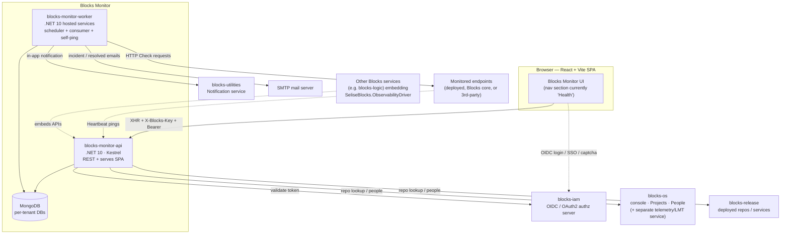
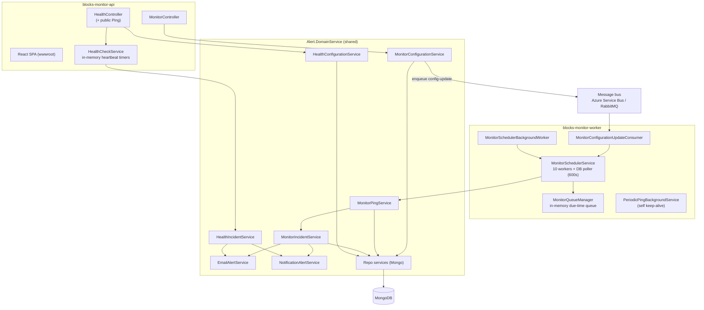
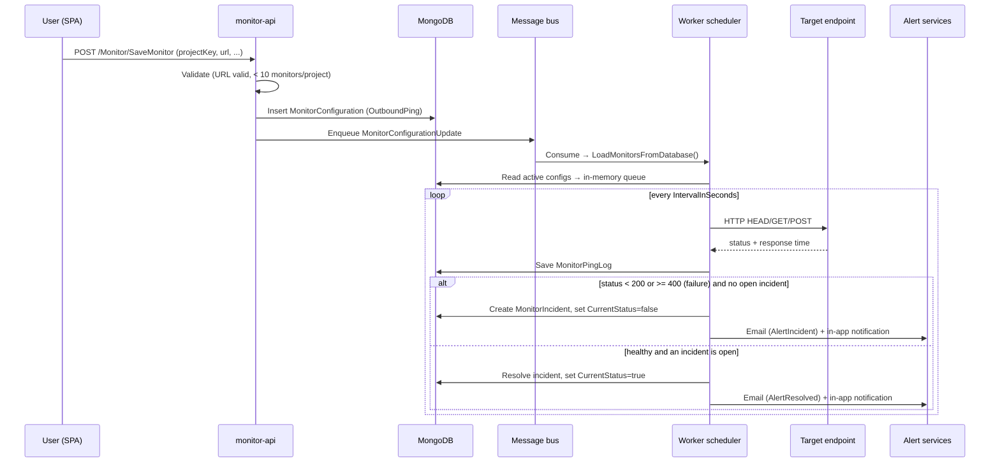
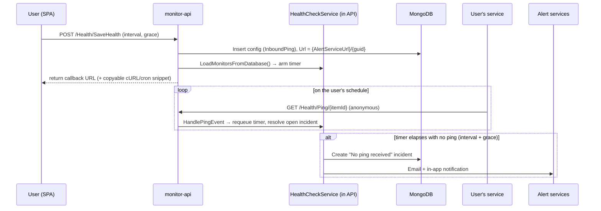
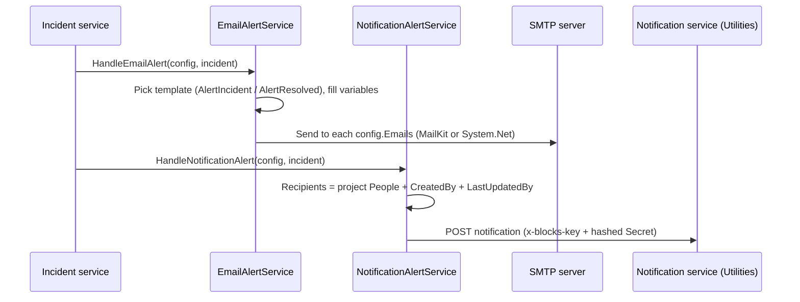

# Blocks Monitor — Architecture Specification

> Scope: `blocks-monitor` (running services `blocks-monitor-api` and `blocks-monitor-worker`).
> Canonical product name is **Blocks Monitor** (short form **Monitor**). The legacy internal name
> **Observability** is retired as a product term but still appears throughout the code
> (`blocks-observability` resource comment in `Api/Program.cs`, the `Observability.Driver` package,
> `IObservabilityDriverService`, `ObservabilityConstants`); those are noted as gaps where relevant.
> **v1 is uptime only** — HTTP Checks, Heartbeats, incidents, and alerting. Logs, tracing, and
> metrics are explicitly owned by a separate telemetry/OS service, not by Blocks Monitor.
>
> Where the current code disagrees with an authoritative product decision, this document describes
> the **decided target state** and flags the delta as **Gap**.

---

## 1. System Context

Blocks Monitor is the **uptime / availability monitoring, incident, and alerting** service of the
SELISE Blocks platform. Everything it stores and does is scoped to a **Project** (an
Environment/tenant); the code carries the project identity as `TenantId`, populated from the
request's `projectKey`. It is a peer of the other four Blocks services and consumes several of them.

Two check styles exist (decided canonical terms):

- **HTTP Check** — "we ping you". Monitor actively sends an HTTP request to a URL on a schedule and
  judges the response. Backend enum `OutboundPing`, saved via `POST /Monitor/SaveMonitor`.
- **Heartbeat** — "you ping us". Monitor issues a unique callback URL and expects the target to call
  it on a schedule; a missed ping opens an incident (dead-man's-switch). Backend enum `InboundPing`,
  saved via `POST /Health/SaveHealth`, pinged at `GET /Health/Ping/{itemId}`.

Monitoring is **not restricted to platform-deployed services** — a user may monitor any third-party
endpoint (decision D2).

**Consumers of Blocks Monitor today:** only `blocks-release` embeds it, consuming a few APIs for
display purposes (decision D3). Other services may embed the API surface through the driver package.

---

## 2. Component Architecture

The repository ships two deployable .NET 10 processes plus one embeddable NuGet package. Both
processes are thin hosts over one shared domain assembly, **`Alert.DomainService`**, wired up via
`Alert.DomainService.ServiceRegistry.AddApplicationServices(services)` in each `Program.cs`.

- **`blocks-monitor-api`** (`server/Api`) — ASP.NET Core. Serves the React SPA from `wwwroot` and
  exposes `MonitorController` (HTTP Checks, incidents, ping/downtime logs) and `HealthController`
  (Heartbeats + the public ping receiver). All management endpoints are `[Authorize]`; only
  `GET /Health/Ping/{itemId}` is anonymous by design (decision B4 — pings come from both background
  services and API services).
- **`blocks-monitor-worker`** (`server/Worker`) — Generic Host running three hosted components:
  `MonitorSchedulerBackgroundWorker` (drives HTTP Checks), `MonitorConfigurationUpdateConsumer`
  (reacts to config-change messages), and `PeriodicPingBackgroundService` (self keep-alive pinger).
- **`Alert.DomainService`** — all business logic: Monitor, Health, Alert, and Shared modules.
- **`Observability.Driver`** (`SeliseBlocks.ObservabilityDriver`) — NuGet package mirroring the
  Monitor + Health surface as `IObservabilityDriverService` so other services can host it locally.

The Heartbeat scheduler (`HealthCheckService`) currently also runs **inside the API process** (it is
constructed by `HealthController`/`HealthConfigurationService` and its timers live there), whereas
HTTP Checks run in the Worker. This split is a real property of the current wiring.

---

## 3. Key Runtime Flows

### 3.1 HTTP Check lifecycle (create → schedule → ping → incident → alert)

Failure is defined in `MonitorIncidentService.HandleIncidentAsync` as
`StatusCode < 200 || StatusCode >= 400`. **4xx responses now count as an outage** (this corrected the
earlier v1 behaviour where only `< 200 || >= 500` failed). `SuccessHttpResponseCodes`,
`ExpectedContent`, `TimeoutInSeconds`, `Regions`, and `MonitorType` values PING/TCP/DNS/KEYWORD are
persisted but **not yet used** to judge health — roadmap, not v1 (decisions: v1 = uptime only).

### 3.2 Heartbeat lifecycle (issue URL → external ping → miss → incident)

The Heartbeat URL is intentionally open (decision B4). v1 ships copyable setup snippets (cURL/cron)
plus docs next to the generated URL (decision #141); the `monitor-card` detail component surfaces the
callback URL.

### 3.3 Alert fan-out (two channels, two audiences)

**Email** goes only to the monitor's explicit recipient list (user-chosen). **In-app notifications**
go to everyone with access to the project, plus the creator and last editor — there is no per-user
in-app targeting (decision B5).

---

## 4. Data Architecture

- **Storage engine:** MongoDB, accessed through the shared `Blocks.Genesis` framework and repo
  services. There is no relational store.
- **Per-tenant isolation:** the platform is multi-tenant; documents carry `TenantId` (= `projectKey`).
  Secrets/DB coordinates are resolved per service from a root Mongo `Secrets` collection using
  `SecretKey = "blocks-secret-monitor"` and `RootDatabaseName` (see both `Program.cs` files). Tenant
  resolution and salting run through `ITenants`/`ICryptoService` (e.g. the notification `Secret` is
  `Hash(RootTenantId, TenantSalt)`).
- **Core collections / entities** (all `BsonIgnoreExtraElements`, all extend `BaseEntity` with
  `ItemId`, `CreatedBy/Date`, `LastUpdatedBy/Date`):
  - `MonitorConfiguration` — one row per check (HTTP Check or Heartbeat). Holds `Url`, `TenantId`,
    `MonitorConfigurationType` (OutboundPing/InboundPing), `MonitorSourceType`
    (Infrastructure / DeployedServices / BlocksServices / ExternalServices / OtherServices),
    `IntervalInSeconds`, `GracePeriodInSeconds`, `TimeoutInSeconds`, `IsActive`, `CurrentStatus`,
    `Emails`, tagging fields (`RepoId/RepoName`, `ExternalServiceId/Name`), and captured-but-unused
    fields (`ExpectedContent`, `SuccessHttpResponseCodes`, `Regions`, `AuthorizationType`,
    `MonitorType`). A legacy `MonitorSourcetypes` field is tolerated via `EffectiveMonitorSourceType`.
  - `MonitorIncident` — one open incident per monitor at a time; `StartTime`, `EndTime`,
    `IsResolved`, `LastStatusCode`, `FailureReason`, `ResponseBody`, and a computed
    `DowntimeDurationSeconds = EndTime − StartTime` (null while unresolved).
  - `MonitorPingLog` — one row per executed HTTP Check (`StatusCode`, `ResponseTimeMs`, `IsSuccess`,
    `Timestamp`). This is where per-check response times are recorded.
  - Alert templates and mail config — `AlertMailTemplate` (`AlertIncident` / `AlertResolved`) and
    `MailServerConfiguration`.
- **Uptime semantics (decisions #126, #143):** uptime% = uptime ÷ window length in seconds, computed
  over 7/30/365-day windows from incident durations. **Target:** exclude paused time (compute over
  checked time only) and freeze "time since last incident" while a monitor is paused.
  **Gap / Open:** the current code computes downtime over fixed calendar windows and does not subtract
  paused time; the paused-time accounting is still open (decision B6).
- **Deletion (decision #125):** deleting a monitor permanently destroys its incident history with no
  undo. `Infrastructure` and `BlocksServices` monitors are protected from update/delete.
- **Read/status flow:** the monitor list joins the last 24h of incidents per monitor; the detail page
  aggregates downtime + incident counts over 7/30/365 days and renders an up/down timeline (see §9).

**Gap:** `Infrastructure` / `BlocksServices` monitors are read-only in this service but **no code in
this repo seeds them** — they are expected to be provisioned by the platform operator / another
service.

---

## 5. AuthN / AuthZ Architecture

- **Authentication:** users sign in through **blocks-iam** via **OIDC** (SSO and captcha config are
  injected into the SPA at runtime — `BLOCKS_IAM_BASE_URL`, `BLOCKS_OIDC_CLIENT_ID`,
  `BLOCKS_GITHUB_SSO_CLIENT_ID`, `BLOCKS_GOOGLE_SITE_KEY`, `BLOCKS_MONITOR_CLIENT_ID`, etc., stamped
  into `wwwroot` from the `FrontendRuntime` config section). Every management endpoint carries
  `[Authorize]`; the identity is read from `BlocksContext.GetContext()?.UserId`.
- **Tenant identification:** requests carry the **`X-Blocks-Key`** tenant key (plus a matching cookie
  for the SPA). Server-to-server calls (e.g. to the Notification service) send `x-blocks-key` and a
  hashed `Secret`. Local dev normalizes `Origin`/`Referer` and uses a permissive CORS policy limited
  to `dev-monitor.blocksdevelopers.com` / `localhost`.
- **Authorization resource:** `ApplicationConfigurations.ConfigureApi(..., serviceAccessResourceName:
  "blocks-os")` — access is governed under the **`blocks-os`** IAM resource today. A code comment in
  `Api/Program.cs` states this will move to a `blocks-observability` resource once IAM has it.
- **Permission scopes / roles — target (decision D4/#150):** Blocks Monitor will gain its own roles:
  **Viewer** (read), **Editor** (create / edit / pause), **Admin** (delete + manage recipients), with
  blocks-os super-permissions still applying. **Gap:** these roles are **not yet implemented**; access
  is currently all-or-nothing under the `blocks-os` resource, and the role set's composition with
  blocks-os is still undecided.
- **Public surface:** only `GET /Health/Ping/{itemId}` is anonymous, by design.

---

## 6. Deployment Architecture

- **Two container images** built from the repo root:
  - `Dockerfile` → `blocks-monitor-api` (`webservice`). Multi-stage: Node 22 Vite build →
    `server/Api/wwwroot`, then `dotnet/sdk:10.0` publish, final `dotnet/aspnet:10.0-alpine`, Kestrel
    on port **5000**, non-root `app` user. (The image `LABEL`/comment still say "blocks-iam" — a
    copy-paste artefact; the build targets `Api.csproj`.)
  - `Dockerfile.worker` → `blocks-monitor-worker` (`worker`).
- **Runtime target:** Azure Kubernetes Service (e.g. `aks-blocks-dev`), image push to an Azure
  Container Registry, then a **GitOps** update to a central repo (`update-gitops-central`) — the
  cluster reconciles from there.
- **CI/CD:** three environment pipelines under `.github/workflows` — `ci-dev.yml`, `ci-stg.yml`,
  `ci_prod.yml` — each calling shared reusable workflows from `blocks-inventory`
  (`build-push.yml`, `update-gitops-central.yml`, optional `sonarqube-dotnet.yml`,
  `sca-scan-dotnet.yml` → Dependency-Track SCA). Both client and worker images are built and
  GitOps-updated per run. Tests/SonarQube/SCA are toggled per environment (off in dev for speed).
- **Environment tiers:** dev / stg / uat / prod. Vault selection is automatic:
  `VaultType.OnPrem` for Development, `VaultType.Azure` otherwise (overridable via
  `BLOCKS_VAULT_TYPE`). Per-tier `appsettings.{env}.json` files exist for both processes.
- **Config injection:** frontend runtime values come from the `FrontendRuntime` config section and
  are token-replaced into the built static assets at startup; `FrontendRuntime__BLOCKS_*` env vars
  override individual keys at deploy time.

---

## 7. Cross-Service Dependencies

**Blocks Monitor depends on:**

- **blocks-iam** — OIDC authentication, token validation, SSO/captcha config; the IAM resource
  (`blocks-os`) that currently gates access.
- **blocks-os** — the console shell it renders inside (`@seliseblocks/blocks-kit`: layout, guards,
  login, project switcher); Project / Environment / People context (project People drive in-app
  notification recipients). Logs / tracing / metrics live on a **separate** telemetry/OS service, not
  in Monitor (decision C1) — cross-nav links and corrected marketing copy are a decided follow-up.
- **blocks-release** — deployed repositories/services used for the "tag a service" (Deployed)
  association (`RepoId`/`RepoName`) and repo lookups. Deployment→monitor auto-creation is **opt-in and
  off by default** (decision D2/#148).
- **blocks-utilities** — the Notification service (`NotificationServiceUrl`) for in-app notifications;
  emails go via a configured SMTP server using stored templates. **Open:** whether Monitor owns its
  alert templates long-term or fully delegates to the central communication service (question D1).
- **A logic / service registry** — for "my services" external-service lookups.

**What depends on Blocks Monitor:**

- **blocks-release** embeds it today for display (decision D3). Embedded monitoring is attributed
  **"powered by Blocks Monitor"** (decision #149).
- Any Blocks service embedding **`SeliseBlocks.ObservabilityDriver`** (`IObservabilityDriverService`)
  to host the Monitor + Health API surface locally. **Gap:** the package is still named/branded
  `observability`.
- Monitored targets are just endpoints (deployed, Blocks core, or third-party) — not a code
  dependency.

---

## 8. Scalability, Reliability & Observability

- **Scheduling model (HTTP Checks):** `MonitorSchedulerService` keeps an in-memory due-time queue
  (`MonitorQueueManager`) and runs **10 worker loops + 1 DB-poller**. Workers peek the queue, and when
  a task is due they fire the ping on a background task and re-enqueue the next execution. The poller
  reloads configs from MongoDB every **600s**, adding new monitors and evicting deleted ones; the
  config-update message queue triggers an immediate reload so new/edited monitors start promptly
  without waiting for the poll.
- **Heartbeats:** `HealthCheckService` maintains per-monitor timers (also 10 worker loops + poller);
  an incoming ping requeues the timer and resolves any open incident.
- **Messaging:** a single config-update queue,
  `blocks_alert_monitor_config_update_listener`. The transport is chosen at runtime from the message
  connection string — **RabbitMQ** for `amqp(s)://`, otherwise **Azure Service Bus** (default).
- **Reliability characteristics (as built):**
  - The scheduler state is **in-memory and per-process**; there is no distributed lock or leader
    election, so running multiple worker replicas would duplicate checks. Treat the worker as a
    singleton unless/until coordination is added.
  - One open incident per monitor prevents alert storms; on-going failing checks update an in-memory
    incident object but only **open** and **resolve** transitions are persisted.
  - Alert send failures are logged and swallowed (email returns success/fail per recipient; a failed
    channel does not block the other).
  - `PeriodicPingBackgroundService` GETs one configured URL on a timer (`PeriodicPingConfiguration`)
    as a self keep-alive. **Decision #147:** this is a real **product feature** (built-in keep-alive
    check) and should be surfaced to users with a configurable URL. **Gap:** today it is an internal,
    config-file-only background task, not surfaced or user-configurable.
- **Abuse safeguard:** a hard cap of **10 monitors per project**, enforced in
  `SaveMonitorConfigurationRequestValidator`. This is an abuse safeguard, not a pricing tier
  (decision C2/#128).
- **Observability of Monitor itself:** structured `ILogger` logging throughout and an ASP.NET
  `AddHealthChecks()` endpoint on the API. Per-check response times are recorded now in
  `MonitorPingLog` (decision #140); a latency chart is roadmap, not v1.

---

## 9. Architectural Decisions & Trade-offs

**ADR-1 — v1 scope is uptime only; telemetry lives elsewhere.**
*Context:* marketing copy advertised logs / tracing / metrics / AI diagnostics; the code implements
only uptime checks, incidents, and alerting, and logs/tracing/metrics are owned by a separate service
(decision C1). *Decision:* Blocks Monitor v1 = HTTP Check + Heartbeat + incidents + alerting; add
cross-nav links to the telemetry service and fix marketing copy. *Consequence:* narrower, coherent
product; unused telemetry-shaped fields and the retired "Observability" naming should be cleaned up.

**ADR-2 — Two check types, one configuration entity.**
*Context:* active outbound checks and passive dead-man's-switch checks share most attributes.
*Decision:* model both as `MonitorConfiguration` distinguished by `MonitorConfigurationType`
(OutboundPing / InboundPing); canonical UX terms are **HTTP Check** and **Heartbeat**. *Consequence:*
simpler storage and shared incident/alert logic, at the cost of triple naming
(Request/OutboundPing/SaveMonitor and Callback/InboundPing/SaveHealth) that decisions standardize on
HTTP Check / Heartbeat.

**ADR-3 — Failure includes 4xx.**
*Context:* the original rule treated 4xx as healthy (only `<200 || >=500` failed). *Decision (as coded
now):* failure is `StatusCode < 200 || StatusCode >= 400`, so 401/403/404 open incidents.
*Consequence:* fewer missed real outages; `SuccessHttpResponseCodes` / `ExpectedContent` remain
roadmap for finer control.

**ADR-4 — Two alert channels, two audiences.**
*Context:* teams want broad visibility plus targeted on-call. *Decision (B5):* in-app notifications go
to everyone with project access (plus creator/last editor); emails go to a user-chosen list.
*Consequence:* no per-user in-app targeting. **Target:** raise the email-recipient cap to a higher
fixed guardrail (~10–20). **Gap / Open:** the UI still caps email recipients at 5, and the exact
number is under review.

**ADR-5 — Scheduler is in-memory, poll + message-driven.**
*Context:* need prompt pickup of new/edited monitors without a per-check DB read storm. *Decision:*
in-memory due-time queue, 600s reconciling poll, plus a config-update message for immediate reload.
*Consequence:* fast and simple, but scheduler state is per-process and not HA-coordinated — the worker
is effectively a singleton; horizontal scaling needs added coordination (see §8).

**ADR-6 — Heartbeat callback URL is public by design.**
*Context:* pings originate from both background services and API services that cannot easily carry
user auth (decision B4). *Decision:* leave `GET /Health/Ping/{itemId}` open; ship copyable cURL/cron
setup snippets and docs (decision #141). *Consequence:* anyone with the GUID URL can mark a heartbeat
alive; the unguessable per-monitor GUID is the only control.

**ADR-7 — Access under the blocks-os IAM resource, with dedicated roles planned.**
*Context:* IAM does not yet have a Monitor-specific resource. *Decision:* gate access under
`blocks-os` now (explicit code comment), and introduce **Viewer / Editor / Admin** roles under a
future `blocks-observability` resource (decision D4/#150). *Consequence:* no fine-grained
create-vs-view separation today. **Gap:** roles unimplemented; resource rename pending.

**ADR-8 — Uptime accounting and the detail timeline.**
*Context:* uptime is shown as "time since last incident" in the list and as a %/7-30-365d on the
detail page. *Decision (#126, #143):* uptime% = uptime ÷ window seconds, excluding paused time; freeze
"time since last incident" while paused; rename the detail page's mislabeled **"Response time"**
section (which renders an up/down status timeline from downtime logs) to **Availability Timeline** /
Status Timeline (decision A5/#140). *Consequence:* clearer reporting. **Gap:** paused-time exclusion
and the section rename are not yet in the code, and paused-time accounting remains open (B6).

**ADR-9 — Embeddable driver package.**
*Context:* other services (e.g. blocks-logic) want monitoring without the full stack. *Decision:* ship
`SeliseBlocks.ObservabilityDriver` exposing the Monitor + Health APIs as one injectable service;
embedded monitoring is attributed "powered by Blocks Monitor" (D3/#149). *Consequence:* reuse across
the suite; the package/brand still carries the retired "observability" name.

**ADR-10 — "Blocks services" is transparency, not a public status page.**
*Context:* tenants want to tell a platform problem from their own. *Decision (C4/#146):* the
read-only **Blocks services** tab shows Blocks core/platform service uptime to signed-in tenants and
supports subscribe-to-platform-incident; **no public status page**. *Consequence:* transparency for
authenticated tenants only; those `BlocksServices` / `Infrastructure` monitors are seeded outside this
repo and protected from tenant edits/deletes.

---

### Open / undecided

- **Dedicated roles composition** — the Viewer/Editor/Admin set and how it composes with blocks-os
  super-permissions is decided in principle but not finalized or implemented (D4/#150).
- **Email recipient cap** — target is ~10–20; the exact number is under review; code still enforces 5
  in the UI (B5/#142).
- **Paused-time in uptime** — whether/how paused time is excluded from uptime accounting is still open
  (B6/#143); current code does not subtract it.
- **Alert-template ownership** — whether Monitor keeps its own SMTP templates or fully delegates to the
  central communication service (D1).
- **In-app nav label** — the in-app section is still labelled **"Health"**; canonical product term is
  **Monitor**. Renaming the nav/section is implied by the naming decision but not yet applied.
